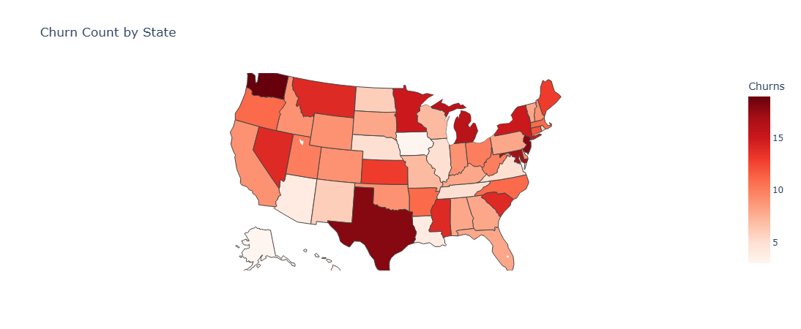
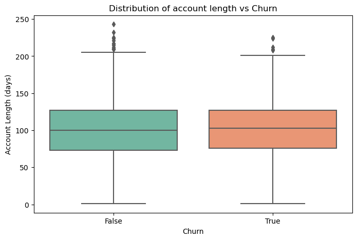

# Syria_tel-Churn-Analysis

## Business Understading
Customer churn occurs when a customer cancels their services or switches to another provider. For Syriatel, this represents a serious threat to profitability and long-term sustainability. In the highly competitive telecommunications industry, where churn rates typically range from 15% to 25%,  churn is one of the most critical performance metrics to monitor and reduce.

Retaining customers is a central part of Syriatel’s strategy. This is because it is significantly more cost-effective to keep existing customers than to acquire new ones. Research shows that acquiring a new customer can be 5 to 10 times more expensive than retaining an existing one. 

Syriatel is one of Syria’s leading telecommunications providers, offering mobile and data services to millions of customers across the country. However, due to the competitive nature of the industry, retaining customers is increasingly challenging. To maintain its market position and continue delivering high-quality services, Syriatel must find effective ways to understand and reduce customer churn.

The objective of this project is to analyze customer behaviour and predict churn using machine learning techniques. By identifying customers at high risk of churning, Syriatel can apply targeted retention strategies to improve customer satisfaction and loyalty. 

### Stakeholder

- The key stakeholders for this project include:  
   - Syriatel Management : To strategize & Implement Customer retention programs
   - Marketing Team: Interested in identifying at-risk customers for targeted retention campaigns.
   - Customer Service Team: They need to understand how support quality and call volume relate to churn so that they can help.
   - Finace Team: Monitors revenue impact from Customer loss and use this insights to forecast revenue and allocate budgets to retention.

### Objectives

- This project aims to:

   - Classify customers as likely to churn ("True") or stay ("False").
   -  Identify factors that contribute most to customer churn.
   - Enable actionable insights to guide SyriaTel’s marketing, sales, and support teams in preventing churn.

## Data Understanding

### Data source

The dataset used for this project is from Kaggle: [Churn in Telecoms Dataset](https://www.kaggle.com/datasets/becksddf/churn-in-telecoms-dataset)

### Variabe Description

- The dataset provided contains customer-level usage and service information from SyriaTel, aimed at identifying patterns that lead to customer churn. 
- The dataset has 3333 rows which represents customers and 21 column which captures features that influence their decision to stay (Not churned) or leave(Churned) the service.
- There are 20 features (independent variables) and 1 target variable (churn). Below is a breakdown of each variable:
   1. state - This shows the state where the customer resides and it can be help identify geographic patterns in churn.
   2. area code - Associated with the customers Phone number.
   3. phone number - Customer's phone number (serves as an Unique identifier)
   4. account length- Duration of customer’s relationship with SyriaTel. 
   5. international plan- Indicates whether the customer has an international calling plan (`yes`/`no`)
   6. voice mail plan - Indicates whether the customer has subscribed to voice mail service plan (`yes`/`no`)
   7. total day calls - Total number of calls made during the day
   8. total day minutes - Total number of minutes the customer has spent on calls during the day
   9. total eve minutes - Total minutes of calls made in the evening
   10. total eve calls - Total number of evening calls
   11. total night minutes- The total number of minutes the customer has spent on calls during the night.
   12. total night calls - The total number of calls the customer has made during the night
   13. total intl minutes -  The total number of minutes the customer has spent on international calls.
   14. total intl calls  -  The total number of international calls the customer has made.
   15. number vmail messages - Number of voice mail messages the customer has received.
   16. total night charge - The total charges incurred by the customer for nighttime calls.
   17. total intl charge - The total charges incurred by the customer for international calls.
   18. total eve charge - Total charges Incurred by the customer for evening call
   19. total day charge - Total charge incurred by the customer for daytime calls
   20. customer service calls - The number of times the customer has called customer service.
   21. churn -  Whether the customer has churned (`True` = churned, `False` = active)

 ### Data Limitation:
- Class Imbalance: about 85.5% of the customers did not churn, while only 14.5% did. This imbalance can affect model performance by making it biased toward predicting the majority class.

### Data Preparation:
- This involves preparing the dataset for analysis and modeling. I carried out the following:

   - Reviewed the structure of the dataset and summarized key statistics
   - Checked for missing values
   - Removed irrelevant columns, such as phone numbers, that don't add value to the analysis
   - Verified and corrected data types where necessary
   - Identified and removed duplicate records where applicable
   - Detected outliers
   - Encoding Categorical Features
   - Data Normalization

 ####  Feature types
 - Categorical Variable:
   - state
   - area code
   - international plan
   - voicemail plan

- Numerical Variable: 
   - account length
   - number vmail messages
   - total day minutes
   - total day calls
   - total day charge
   - total eve minutes
   - total eve calls
   - total eve charge
   - total night minutes
   - total night calls
   - total night charge
   - total intl minutes
   - total intl charge
   - customer service calls  

 ## Exploratory Data Analysis (EDA) 
- Churn Rate
- Distributions of Numeric & Categorical features
- Factors that contribute most to customer churn.
- Univariate Analysis
- Bivariate Analysis

### Churn Distribution
- From the class distribution, we observe that 85.5% of the customers did not churn while only 14.5% churned. This shows a significant class imbalance. 

### Factors that contribute most to customer churn.
- To better understand what drives customers to leave, I grouped the variables into thematic areas and explored their impact on churn. These factors include:
   - Tenure (Account Length) - to understand if longer-term customers are more or less likely to churn.
   - Geographical Factors(State) - to detect regional or location-based trends in churn.
   - Service Plan Subscriptions (International Plan & Voice Mail Plan) — Does having specific plans influences churn likelihood
   - Usage behaviour (Call & Minute Usage during all period of time) — Does high or low usage patterns are linked to churn.
   - Financial Impact (Charges): to evaluate if higher billing is associated with customer dissatisfaction and churn.
   - Customer Service Interaction (Number of Customer Service Calls) — Does frequent service contact signals dissatisfaction.

#### Geographical Analysis

- To support the company’s location based retention strategy, I identified which states have the highest number of churned customers.
- I visualized the churn intensity to helps the company to prioritize outreach efforts and marketing campaigns in high-churn states and design targeted interventions by region.
   - Washington, New jersey & Texas have the highest customers who have churned
   - Majority of other states reflect a moderate level of churn and shouldn't be overlooked when designing region-specific retention strategies

#### Tenure
- To understand how customer longevity influences churning, I analyzed how long each customer has been with the company (in days).

- *Are newer customers more likely to churn or do long-term customers tend to stay?*
   - The spread and median of tenure for churned and non-churned customers look very similar.
   - Both groups have a median around 100 days.
   - Churned customers do not appear to have dramatically shorter or longer tenures compared to loyal ones.

#### Financial impact
- I compared the total revenue from churned vs. non-churned customers, and shows what percentage of overall revenue each group contributes.
- Churned customers account for 15.9% of the company’s total revenue loss. On average, each customer who leaves contributes approximately 1.4% to that lost revenue.

#### Service Plan Analysis
- To understand the impact of service subscriptions on churn, I examined whether having an international plan or a voice mail plan made customers more or less likely to churn.
   - Customers with an international plan are significantly more likely to churn compared to those without.
   - Customers with a voice mail plan are less likely to churn.
   - The highest risk group is international plan customers with no voicemail Services and the company should have immediate action  for these group of customers

#### Customer Service Calls
- To assess whether customer dissatisfaction drives churn, I examined the number of customer service calls made, as repeated contact without support may indicate unresolved issues or frustration.
   - Customers who churned made an average of 2.23 calls.
   - Customers who stayed made an average of 1.45 calls.

- The difference of just one extra call on average suggests a thin line between staying and churning, even a small increase in service issues can tip a customer toward leaving.

- The churn rate increases sharply with the number of service calls therefore the company should work on the first contact resolution
      - Churn decreases with lower support calls, especially for long-tenure customers
      - Once customers hit 5 or more service calls, churn shoots up (above 50%+) indicating rising dissatisfaction

#### Diffrent Time Period usage Analysis.
- To understand whether customer activity levels influence churn, I analyzed usage patterns across different time periods and services to see if low or high engagement is linked to a higher likelihood of churn.
   - Churned customers generally use more call minutes, particularly during the day, than those who remain. This could suggest that higher usage may lead to greater sensitivity to costs, influencing their decision to leave.
   - The number of calls (day, evening, night, international) remains nearly the same between both groups.

### Strategies to Reduce Churn
- Observation:
   - Churn rates vary significantly across states, with certain regions (e.g., Washington, Texas) showing notably higher churn levels.
   - Churn appears more likely among customers at both ends of the tenure spectrum (very new and long term users) with churned users having a slightly higher average account length, indicating early drop-offs and late disengagement.
   - Customers subscribed to the international plan are approximately 4 times more likely to churn, suggesting potential dissatisfaction with pricing or perceived value. In contrast, those with the voice mail plan are more likely to stay, indicating its possible role in enhancing user satisfaction.
   - Although differences in call usage are subtle, churned customers tend to use more day and international minutes, which may signal either heavy reliance or cost-related concerns.
   - Churned users incur higher average charges, especially during daytime and international calls, reinforcing the idea that high-spending customers may feel less value for money.
   - There is a strong positive relationship between customer service interactions and churn. Customers who make 4 or more calls to support are at particularly high risk, possibly due to unresolved complaints or poor service experiences.

- Recomendation:
   - Run localized campaigns in high-churn states (Washington, Texas) with deeper nvestigation into region specific issues like service quality, network coverage or billing concerns.
   - Develop onboarding programs for new customers and loyalty program for long term customers to reduce early drop-offs and late disengagement.
   - Proactively monitor customers with 3+ surpport calls and prioritize them for resolution. Train customer service team to resolve issues on the first contact to prevent frustration.
   - Reassess the value proposition of the international plan. This could involve improving call quality, reducing costs, or bundling with other perks to increase satisfaction.
   -  Consider making the voice mail plan a default offering or promote it more actively, given its positive association with retention.
   - Introduce spending caps or usage notifications for customers who pay more especially during daytime & International calls to help manage expectations and reduce bill shock as these users are more likely to churn.

## Modeling

- Objective
    - The goal is to predict customer churn for SyriaTel using available customer data. This helps the company proactively retain customers likely to stop using the service.

### Data Preparation
- I encoded categorical variables (international plan, voice mail plan, churn).
- I standardized features using StandardScaler.
- To address the imbalanced (churn rate ~14%) datasets i have applied SMOTE (Synthetic Minority Oversampling Technique) on the training data to create a balanced training set.

### Models used
- Logistic Regression (No resampling): checking how well logistic regression works without doing anything about imbalanced data (if some classes appear much more than others).
    - Accuracy: 72%
    - High recall for churners (81%) but low precision (30%), indicating many false positives.

- Logistic Regression + SMOTE : Uses SMOTE, which artificially creates more examples of the minority class to improve fairness of the model. This helps the model learn both classes more equally.

- Random Forest Classifier: Performed significantly better with high accuracy and good recall for churners, making it suitable for deployment.
    - Accuracy: 93%
    - Churn Precision: 71%, Recall: 82%
    - Confusion Matrix:
         - 543 True Negatives
         - 76 True Positives
         - 31 False Positives (Type I errors)
         - 17 False Negatives (Type II errors)

#### Model Comparisons 
- class 1 = churn

| Model                      | Confusion Matrix         | Accuracy | Recall (Class 1) | F1-Score (Class 1) | Support (Class 1) |
| ---------------------------| ------------------------ | -------- | ---------------- | ------------------ | ----------------- |
| 1. Logistic (No SMOTE)     | `[[552, 22], [75, 18]]`  | 0.85     | 0.19             | 0.27               | 93                |
| 2. Logistic + SMOTE        | `[[402, 172], [18, 75]]` | 0.72     | 0.81             | 0.44               | 93                |
| 3.**Random Forest + SMOTE**|**`[[543, 31], [17, 76]]`**| **0.93**| **0.82**         | **0.76**           | **93**            |

#### Model Interpretation
- Logistic no resampling: has high accuracy, but very poor recall and F1 for the minority class. It misses many potential churners, making it less suitable for identifying at risk customers.
- Logistic + SMOTE improves recall for churners a lot, but loses accuracy by catching churners, but misclassifies many non-churners.
- Random Forest + SMOTE gives the best of both worlds:
     - Highest overall accuracy
     - High recall and F1-score for churners
     - Balanced performance for both classes

#### Model Selection

- I selected Random Forest model combined with SMOTE resampling as the final model for deployment as it achieves:
     - Highest accuracy (93%)
     - Strong recall (82%) for identifying churners
     - Best F1-score (76%) which balances precision and recall

- Class imbalance is addressed using SMOTE, improving the model's ability to detect minority cases.
- Random Forest captures complex relationships in customer behavior better than linear models like logistic regression.

### Business Implication for SyriaTel

- This model enables early and accurate detection of customers likely to churn, which directly supports SyriaTel’s goal of proactive customer retention. With this insight, the business can:
    - Target at-risk customers with personalized offers or service improvements
    - Reduce churn rates which protects recurring revenue
    - Optimize marketing spend focusing only on customers who truly need retention efforts
    - Improve customer satisfaction by intervening before dissatisfaction leads to loss

### Areas for Enhancement:

While the current analysis provided a strong starting point for churn prediction, there are several areas that could be explored further to improve model performance and business impact, given more time or deeper expertise.

- Model Refinement
   - Apply hyperparameter tuning (Grid Search or Randomized Search) to optimize Random Forest model.
   - Explore advanced ensemble models such as Gradient Boosting.

- Model Deployment & Monitoring
   - Convert the final model into a deployable format and integrate it with existing CRM database
   - Implement real-time monitoring to track the model performnace overt time

